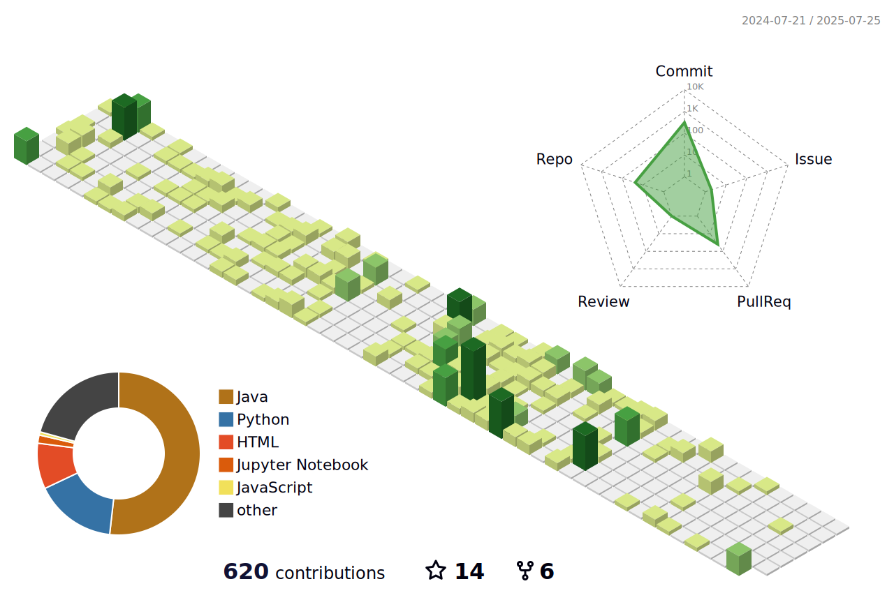

My name is [Minglai Yang](https://mlyann.github.io)
==================================================================================================================================

Researcher @[IVILAB](https://ivilab.org/), @[CLULAB](https://clulab.org/), @[ML4AI LAB](https://ml4ai.github.io/) && President @ [UArizona AI Club](https://uaaiclub.com/)
----------------
 </h2>

I am a high-achieving Computer Science student at the University of Arizona with a perfect 4.0 GPA, specializing in software development, probabilistic modeling, and machine learning. With hands-on experience as a Machine Leanring Engineer intern at [CoreTechs](https://www.coretechs.com/), where I contributed to full-time, in-person and client-oriented projects. I will be a visiting researcher in Tsinghua University this summer.

I am proficient in Python, JavaScript, and AWS, and have successfully led projects involving AI integration, web development, and data analysis. My academic journey includes developing dynamic Bayesian networks for human-AI interaction models, enhancing decision-making and computationally understand human-beings.

* 🌍  I'm based in United States.
* ✉️  You can contact me at [mingly@arizona.edu](mailto:mingly@arizona.edu)
* 🧠  I'm learning Python, Swift, Java, JavaScript, AI and ML
* 🤝  I'm open to collaborating on Projects. This is one project I'm contributing to: https://ml4ai.github.io/tomcat/
* ⚡  I love reading machine learning theory and applied math papers and developing multi-modal models.
* 🤩 If you pay interest, please [visit my website](https://ymingl.com/).

# 💻Tech Stack

  <!-- Python -->
  
  <!-- Git -->
  
  <!-- Java -->
  
  <!-- HTML5 -->
  
  <!-- CSS3 -->
  
  <!-- JavaScript -->
  
  <!-- Matlab -->
  
  <!-- AWS -->
  
  <!-- MySQL -->
  
  <!-- NodeJS -->
  
  <!-- Swift -->
  
  <!-- PHP -->
  
  <!-- Linux -->
  
<!-- Azure -->

# 📊GitHub Stats :

### Coffee Chat

To everyone, if you would like to chat about life, career plan, or research ideas related to AI/ML, feel free to email me ([mingly@arizona.edu](mailto:mingly@arizona.edu)) to schedule a meeting. I will dedicate 30 mins every week for such meetings. 

</ul>
